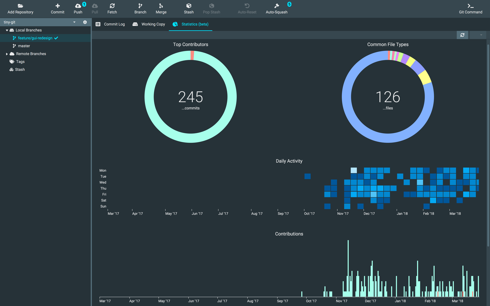

## TinyGit
A very small, fast and portable Git GUI.
Repositories can be configured with credentials, SSH keys and proxies separately.
No need to toggle the proxy setting of `.gitconfig`.


Analyse your and other repositories with the help of TinyGit's statistics.



### Build

Easiest way is to build with the shipped Gradle script. You do not need to install Gradle on your machine.
Just call

```bash
chmod +x gradlew
./gradlew clean assemble
```

for Mac OS and Linux or

```bash
gradlew.bat clean assemble
```

for Windows.

### Usage

TinyGit runs only with a [Git](https://git-scm.com/downloads) installation on your device.

For Mac OS this should be installed via `brew install git`.

Requires Java 11 to be installed.

```bash
java -XX:+UseParallelGC -jar tinygit-x.x.x.jar
```

### Features

 - Creating and cloning Git repositories
 - Separate settings for each repository
 - Working with branches
 - Working with stashes
 - Working with tags
 - Automatic squashing of feature branches
 - Automatic reset if a branch diverged from remote branch
 - Repository statistics

### Missing Features

 - Word-by-word diff
 - Viewing stashes
 - Staging/unstaging code blocks
 - Saving split pane dividers
 - Opening selected file in explorer/finder
 - Opening pull requests
